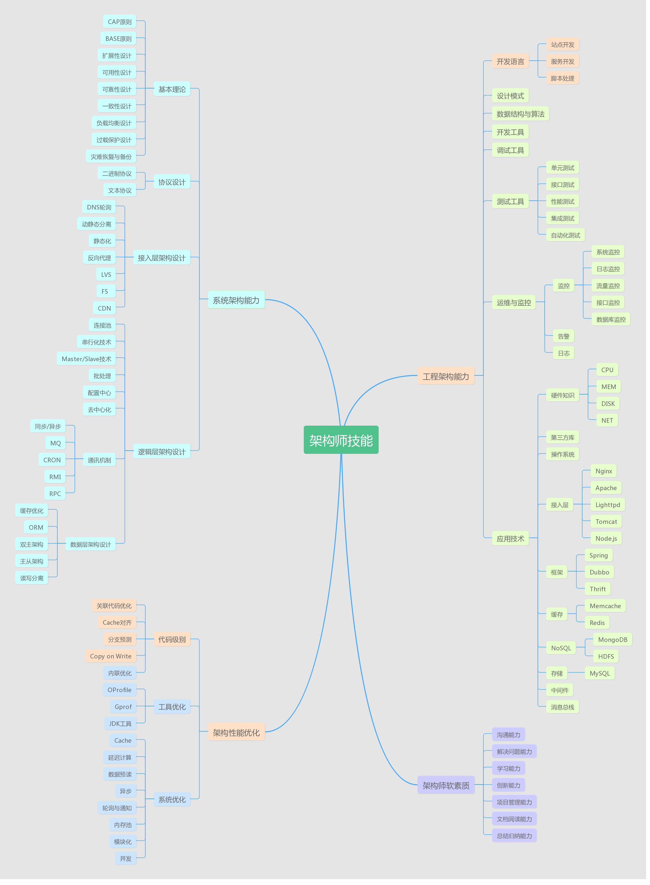

# 软件架构师技术栈

从实用角度出发，将软件架构师的技术栈分为四个方向：

* 系统架构能力
  * [基本理论](the-capability-of-system-architecture/1.-ji-ben-li-lun/)
  * [协议设计](the-capability-of-system-architecture/untitled-1.md)
  * [接入层架构设计](the-capability-of-system-architecture/3.-jie-ru-ceng-jia-gou-she-ji.md)
  * [逻辑层架构设计](the-capability-of-system-architecture/4.-luo-ji-ceng-jia-gou-she-ji.md)
* 工程架构能力
  * [开发语言](gong-cheng-jia-gou-neng-li/untitled.md)
  * [设计模式](gong-cheng-jia-gou-neng-li/2.-she-ji-mo-shi.md)
  * [数据结构与算法](gong-cheng-jia-gou-neng-li/3.-shu-ju-jie-gou-yu-suan-fa.md)
  * [开发工具](gong-cheng-jia-gou-neng-li/4.-kai-fa-gong-ju.md)
  * [调试工具](gong-cheng-jia-gou-neng-li/5.-tiao-shi-gong-ju.md)
  * [测试工具](gong-cheng-jia-gou-neng-li/6.-ce-shi-gong-ju.md)
  * [运维与监控](gong-cheng-jia-gou-neng-li/7.-yun-wei-yu-jian-kong.md)
  * [应用技术](gong-cheng-jia-gou-neng-li/8.-ying-yong-ji-shu.md)
  * [项目管理](gong-cheng-jia-gou-neng-li/9.-xiang-mu-guan-li.md)
* 架构性能优化
  * [代码优化](jia-gou-xing-neng-you-hua/untitled.md)
  * [工具优化](jia-gou-xing-neng-you-hua/2.-gong-ju-you-hua.md)
  * [系统优化](jia-gou-xing-neng-you-hua/3.-xi-tong-you-hua.md)
* 架构师软技能
  * [沟通能力](jia-gou-shi-ruan-ji-neng/untitled.md)
  * [解决问题能力](jia-gou-shi-ruan-ji-neng/2.-jie-jue-wen-ti-neng-li.md)
  * [学习能力](jia-gou-shi-ruan-ji-neng/3.-xue-xi-neng-li.md)
  * [创新能力](jia-gou-shi-ruan-ji-neng/4.-chuang-xin-neng-li.md)
  * [文档阅读能力](jia-gou-shi-ruan-ji-neng/5.-wen-dang-yue-du-neng-li.md)
  * [总结归纳能力](jia-gou-shi-ruan-ji-neng/6.-zong-jie-gui-na-neng-li.md)

