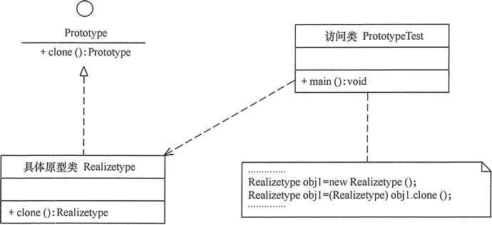
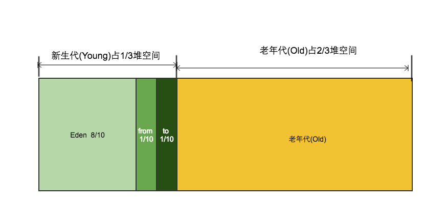

# 创建型模式

### 单例模式（Singleton）


某个类只能生成一个实例，该类提供了一个全局访问点供外部获取该实例，其拓展是有限多例模式。


### 原型模式（Prototype）


将一个对象作为原型，通过对其进行复制而克隆出多个和原型类似的新实例。


### 工厂方法（FactoryMethod）


定义一个用于创建产品的接口，由子类决定生产什么产品。


### 抽象工厂（AbstractFactory）


提供一个创建产品族的接口，其每个子类可以生产一系列相关的产品。


### 建造者模式（Builder）


将一个复杂对象分解成多个相对简单的部分，然后根据不同需要分别创建它们，最后构建成该复杂对象。


