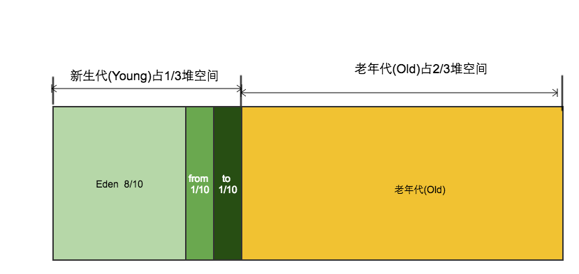

# 结构型模式

### 代理模式（Proxy）


为某对象提供一种代理以控制对该对象的访问。即客户端通过代理间接地访问该对象，从而限制、增强或修改该对象的一些特性。


对于代理模式，有个缺点，就是真实类必须预先存在。否则，无法实现代理类，对此，延伸出了改进的动态代理模式，即不需要关注真实类，都能实现代理类。Spring AOP采用两种实现方式，第一种就是通过JDK的动态代理类Proxy来实现，第二种是通过Cglib改变字节码来实现，第一种的类图如下：

### 

### 适配器模式（Adapter）


将一个类的接口转换成客户希望的另外一个接口，使得原本由于接口不兼容而不能一起工作的那些类能一起工作。


类适配器相当于在原业务类的上层套一个壳以满足新业务的接口，在Java中1.8之前，由于没有多继承，所以需要用一个接口和一个适配器类来实现模式，但是1.8之后由于可以对接口写抽象方法的默认实现，也就只需要用一个接口就可以实现适配器模式，对于C++，由于天生支持多继承，直接可以实现适配器。

方法适配器通过引用对象的方式实现。

### 

### 桥接模式（Bridge）


将抽象与实现分离，使它们可以独立变化。它是用组合关系代替继承关系来实现的，从而降低了抽象和实现这两个可变维度的耦合度。


桥接主要是利用引用的方式代替继承的高耦合，将属性抽象化，然后引用抽象化的属性

### 装饰模式（Decorator）


动态地给对象增加一些职责，即增加其额外的功能。


在具体类上进行装饰，而不改变原来的类的方法，符合开闭原则

### 外观模式（Facade）

当需要增加或删除子系统时，虽然不用修改客户类，但是需要改变Facade类，这就有悖于开闭原则，所以改进如下：

### 享元模式（Flyweight）


运用共享技术来有效地支持大量细粒度对象的复用。


对大量相同特性的对象引用同一个对象

### 组合模式（Composite）


将对象组合成树状层次结构，使用户对单个对象和组合对象具有一致的访问性。


透明方式的组合模式对客户来说是透明的，不区分树枝节点和树叶节点，但是由于树叶节点比树枝节点实际上是缺少了部分方法的实现，所以有一些安全的问题。

安全模式区分了树枝节点和树叶节点，所以没有安全问题，但是对客户来说区分了这两个节点，所以不再是透明的。

